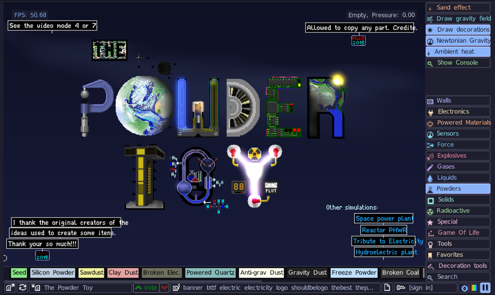

# Powder Forge

A modernised web interface for [The Powder Toy](https://powdertoy.co.uk) — the classic open-source physics sandbox.

**[▶ Play in your browser](https://powder-forge.pages.dev)**



---

## What's different from The Powder Toy

- Dark UI using the [Catppuccin Mocha](https://catppuccin.com) palette
- TrueType font rendering (stb_truetype, 4× supersampled) instead of the original bitmap font
- Runs entirely in the browser via WebAssembly — no installation required
- CORS proxy so in-game login, saves, and browsing all work from the browser
- Greek column pixel art sidebars

All game logic, elements, saves, and online features are unchanged from the original.

---

## Building

### Native (Linux)

```bash
meson setup build -Dapp_name="Powder Forge"
ninja -C build
./build/powder
```

### WebAssembly (Cloudflare Pages)

Requires [emsdk](https://emscripten.org/docs/getting_started/downloads.html) and a DejaVu Sans font:

```bash
cp /usr/share/fonts/truetype/dejavu/DejaVuSans.ttf resources/

meson setup build-wasm \
  --cross-file .github/emscripten-ghactions.ini \
  -Dstatic=prebuilt \
  -Doptimization=2 \
  -Dapp_name="Powder Forge"

ninja -C build-wasm
```

**Local preview:**
```bash
cd build-wasm && python3 serve.py
# open http://localhost:8000
```

**Deploy to Cloudflare Pages:**
```bash
npm install -g wrangler
wrangler login
cd build-wasm && wrangler pages deploy . --project-name powder-forge
```

---

## License

Powder Forge is free software released under the **GNU General Public License v3.0** — see [`LICENSE`](LICENSE).

Based on [The Powder Toy](https://github.com/The-Powder-Toy/The-Powder-Toy) © Simon Robertshaw et al., also GPL v3.
